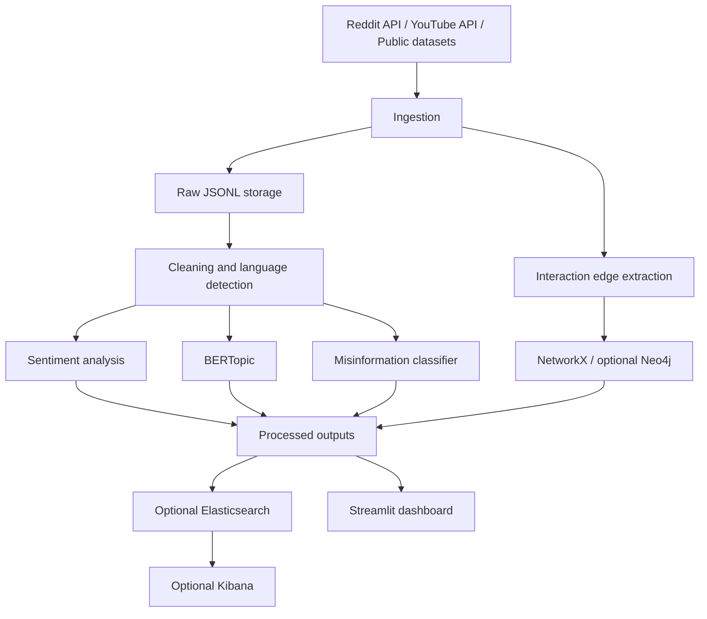

# Architecture

```mermaid
flowchart TD
    A[Reddit API / YouTube API / Public datasets] --> B[Ingestion]
    B --> C[Raw JSONL storage]
    C --> D[Cleaning and language detection]
    D --> E[Sentiment analysis]
    D --> F[BERTopic]
    D --> G[Misinformation classifier]
    B --> H[Interaction edge extraction]
    H --> I[NetworkX / optional Neo4j]
    E --> J[Processed outputs]
    F --> J
    G --> J
    I --> J
    J --> K[Optional Elasticsearch]
    J --> L[Streamlit dashboard]
    K --> M[Optional Kibana]
```

This is the target design, not a claim that every component is implemented.
